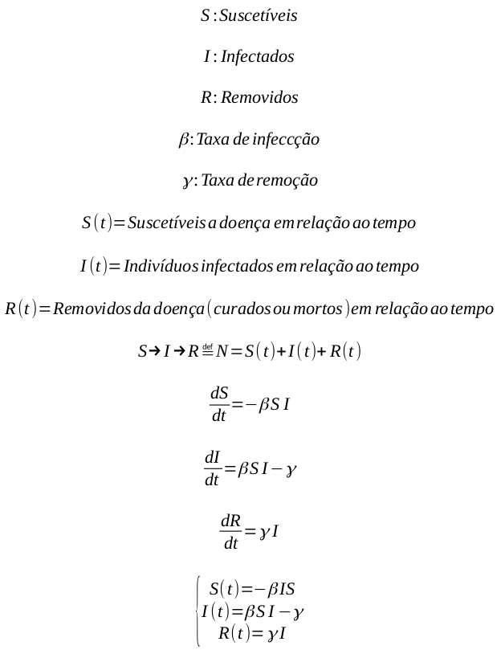

## Covid-19 Model Sir

A simple notebook that tests the SIR model.

## References

- [SIR Model](https://pt.wikipedia.org/wiki/Modelo_epid%C3%AAmico#O_Modelo_SIR)
- [COVID-19 Data Brazil - Source 1](https://pt.wikipedia.org/wiki/Pandemia_de_COVID-19_no_Brasil)
- [COVID-19 Data Brazil - Source 2](https://en.wikipedia.org/wiki/2020_coronavirus_pandemic_in_Brazil)
- [Inspired by HashLDash](https://www.youtube.com/watch?v=XaNvUEX9Kbc)

### Credits to [William Scaff](https://github.com/Huyston)
